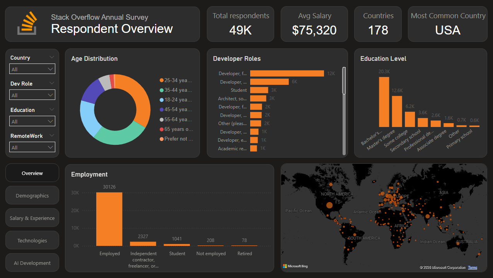
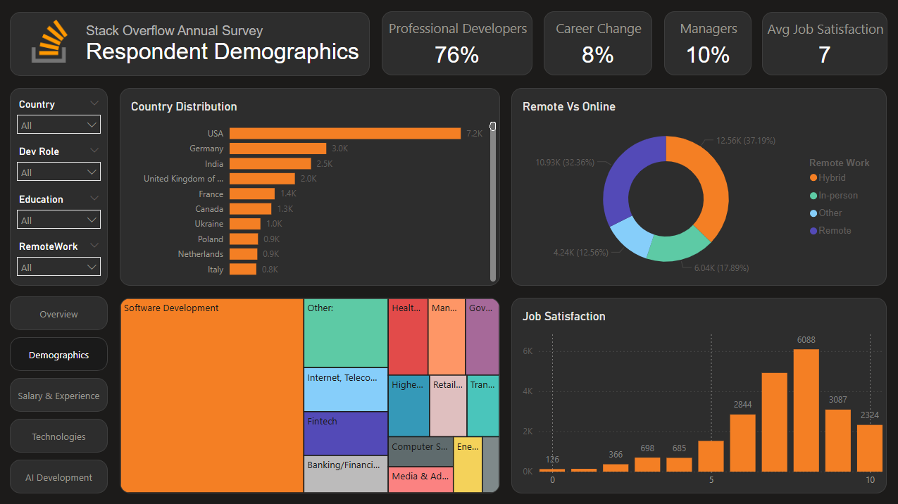
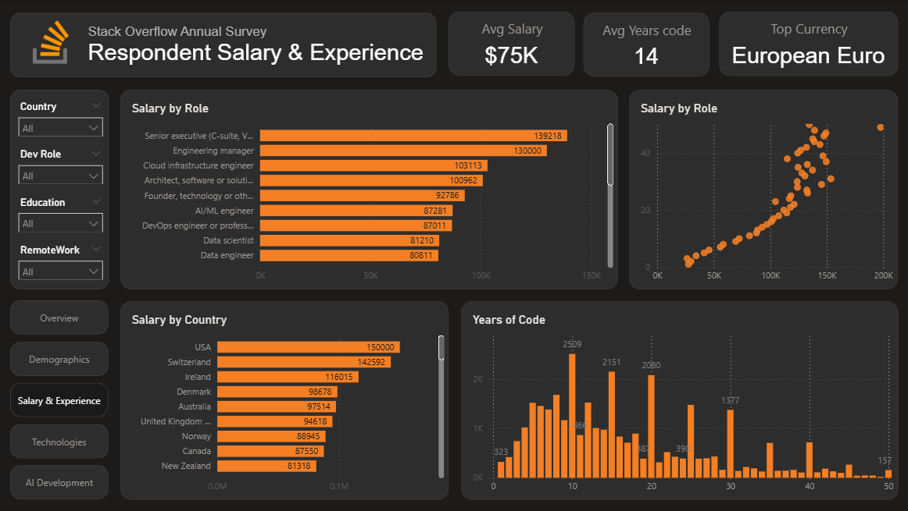
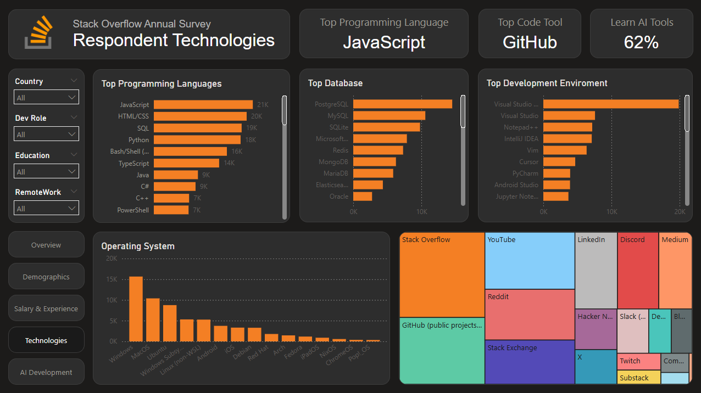
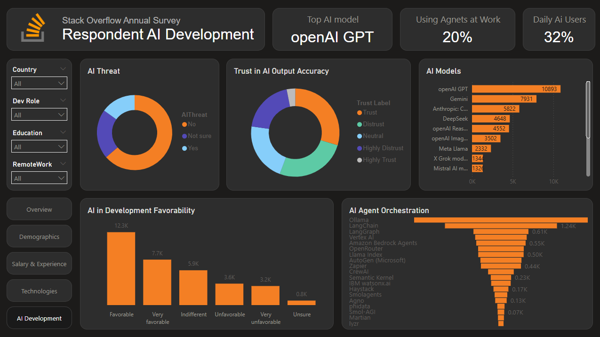

# 📊 Stack Overflow Developer Survey 2025 — Power BI Dashboard


An interactive Power BI dashboard built on the **Stack Overflow Annual Survey 2025** dataset, providing insights into developer salaries, technologies, demographics, and AI adoption trends across 178 countries.

---

## 🖼️ Dashboard Preview

### Overview


### Demographics


### Salary & Experience


### Technologies


### AI Development


---

## 📌 Key Insights

| Metric | Value |
|---|---|
| Total Respondents | 49K |
| Average Salary | $75,320 |
| Countries Represented | 178 |
| Most Common Country | USA |
| Top Programming Language | JavaScript |
| Top Code Tool | GitHub |
| Top AI Model | openAI GPT |
| Daily AI Users | 32% |

---

## 📂 Dashboard Pages

| Page | Description |
|---|---|
| **Overview** | High-level summary — respondent count, salary, age, employment, and world map |
| **Demographics** | Country distribution, remote work split, industry treemap, job satisfaction |
| **Salary & Experience** | Salary by role & country, years of coding experience, scatter plot |
| **Technologies** | Top languages, databases, IDEs, operating systems, and learning resources |
| **AI Development** | AI threat perception, trust in AI, model usage, agent orchestration tools |

---

## 🔍 Filters Available

All pages support the following interactive slicers:

- **Country** — Filter by respondent country
- **Dev Role** — Filter by developer role
- **Education** — Filter by education level
- **Remote Work** — Filter by work arrangement (hybrid / remote / in-person)

---

## 🛠️ Tools & Technologies

- **Power BI Desktop** — Dashboard development
- **Power Query** — Data cleaning and transformation
- **DAX** — Calculated measures and KPIs
- **Stack Overflow Survey 2025** — Source dataset

---

## 📁 Repository Structure

```
StackOverflow-Developer-Survey-2025-Dashboard/
│
├── 📁 data/
│   └── survey_results_public.csv       # Download from: https://survey.stackoverflow.co/
│
├── 📁 screenshots/
│   ├── 1-overview.png
│   ├── 2-demographics.png
│   ├── 3-salary_experience.png
│   ├── 4-technologies.png
│   └── 5-ai_development.png
│
├── 📄 StackOverflowDashboard.pbix      # Power BI file
└── 📄 README.md                        # Project documentation
```

---

## 🚀 Getting Started

### Prerequisites
- [Power BI Desktop](https://powerbi.microsoft.com/desktop/) (free)

### Steps

1. **Clone the repository**
   ```bash
   git clone https://github.com/KhalidAhmed1s/stack-overflow-survey-dashboard.git
   cd stack-overflow-survey-dashboard
   ```

2. **Download the dataset** (if not included due to size)
   - Visit: [Stack Overflow Annual Survey](https://survey.stackoverflow.co/)
   - Download the 2025 public results CSV
   - Place it inside the `data/` folder

3. **Open in Power BI Desktop**
   - Open `StackOverflowDashboard.pbix`
   - If prompted, update the data source path to point to your local `data/` folder

4. **Refresh data** and explore!

---

## 📊 Data Source

- **Source:** [Stack Overflow Annual Developer Survey 2025](https://survey.stackoverflow.co/)
- **License:** ODbL (Open Database License)
- The dataset is publicly available and free to use for analysis and visualization.


